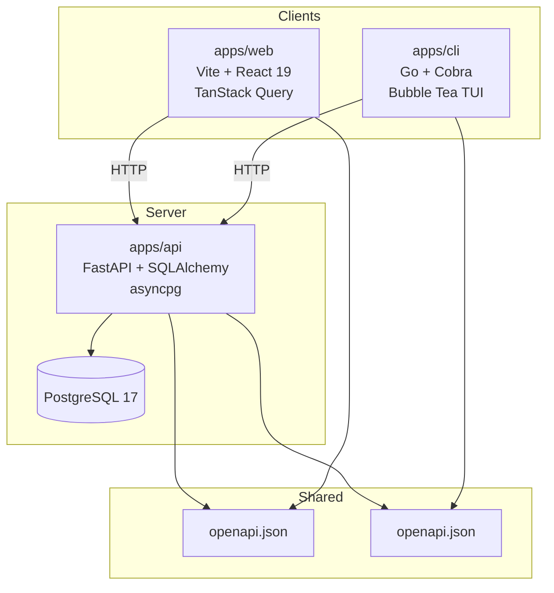
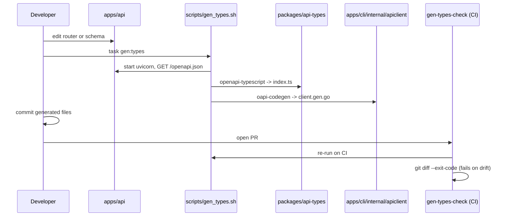
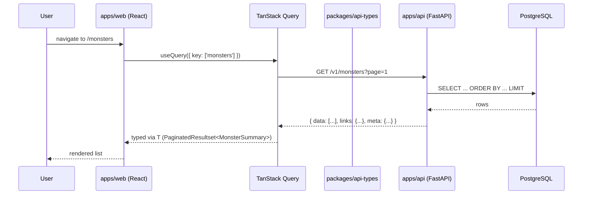

# Architecture overview

DelveMoar is three apps in one monorepo, bound together by a single OpenAPI
contract. This document is the high-level map. Each section below links to
a deeper doc.

## The three apps

| App         | Path        | Stack                                           | Audience                    |
| ----------- | ----------- | ----------------------------------------------- | --------------------------- |
| **api**     | `apps/api/` | Python 3.12, FastAPI, SQLAlchemy 2 async, Alembic, asyncpg | All clients                 |
| **web**     | `apps/web/` | TypeScript, Vite, React 19, TanStack Query, Radix Themes | Browser users               |
| **cli**     | `apps/cli/` | Go 1.23, Cobra, Bubble Tea, lipgloss            | Terminal-first power users  |

Plus one shared package today:

| Package           | Path                       | Purpose                                       |
| ----------------- | -------------------------- | --------------------------------------------- |
| **api-types**     | `packages/api-types/`      | TypeScript types generated from `openapi.json` |

The Go client is generated into `apps/cli/internal/apiclient/` rather than
into a separate package, because it is consumed only by the CLI.

## How the apps stay in sync

The API's `openapi.json` is the single source of truth for the contract.
The web and CLI generate their client code from it, and CI fails any PR
that lets the generated files drift from the schema.

See [openapi-pipeline.md](openapi-pipeline.md) for the full pipeline,
the OpenAPI 3.1 to 3.0.3 downgrade quirk, and what to do when the CI
drift check fails.

## Request flow (public catalog read)

A typical read request from the web app:

Authenticated requests add two things to this path: the browser sends an
opaque, server-side session cookie, and it echoes a readable CSRF cookie
in a header on state-changing requests (double-submit CSRF). Signed-in
users can manage their account and curate catalog content into books.
Per-user homebrew authoring and campaigns are still to come.

## Versioning and contracts

- The API mounts resource routers under `/v1/`. `/health` is intentionally
  unversioned because it is infrastructure, not a resource.
- The OpenAPI schema is served at `/openapi.json` and downgraded from
  3.1 to 3.0.3 at serve time, because `oapi-codegen` does not yet support
  3.1. See [openapi-pipeline.md](openapi-pipeline.md) for the workaround.
- Pagination follows the [White House API standards](https://github.com/WhiteHouse/api-standards):
  envelopes carry `data`, `links`, and `meta`. Schemas live in
  `apps/api/app/schemas/pagination.py`.

## Web architecture

The web app uses a [bulletproof-react](https://github.com/alan2207/bulletproof-react)
features layout, with architectural boundaries enforced by ESLint via
`eslint-plugin-boundaries`. Cross-feature imports are blocked outright.

See [web-features-layout.md](web-features-layout.md) for the layer
hierarchy, what is allowed where, and where to put new code that does not
fit a feature.

## Where to look next

- Want to add an endpoint? Read
  [recipes/adding-a-new-endpoint.md](../recipes/adding-a-new-endpoint.md).
- Want to run the system locally? Read
  [recipes/local-development.md](../recipes/local-development.md).
- Want to understand the codegen contract? Read
  [openapi-pipeline.md](openapi-pipeline.md).
- Looking for terminology? Read [../glossary.md](../glossary.md).
