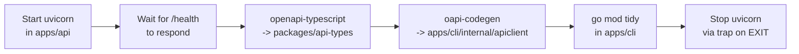

# OpenAPI pipeline

The API's `openapi.json` is the single source of truth for the contract
between the server and its clients. The web app's TypeScript types and the
CLI's Go HTTP client are both generated from it. CI fails any PR that lets
the generated files drift.

This document explains how the pipeline works, when to run it, and what to
do when it breaks.

## Why a generated client

The shape of every request and response is defined once, in the API's
Pydantic schemas. The clients then receive that shape automatically:

- The web app gets compile-time type safety for every endpoint without
  hand-writing TypeScript that mirrors the Python.
- The CLI gets a typed Go HTTP client without hand-writing structs.
- Drift between client and server is impossible to commit, because CI
  re-runs the generator and diffs the output.

The cost is that two files in the tree are generated, never hand-edited:

- `packages/api-types/src/index.ts` (TypeScript)
- `apps/cli/internal/apiclient/client.gen.go` (Go)

If you find yourself wanting to edit either, regenerate them instead.

## The pipeline, step by step

`scripts/gen_types.sh` does five things in sequence:



1. **Start the API in the background.** `uv run uvicorn app.main:app` on
   port 8000, log level `warning`. The script captures the PID and sets a
   `trap` so the server is killed on exit, even if a later step fails.
2. **Wait for `/health` to respond.** Up to 30 seconds. If the API never
   becomes healthy, the script bails with a pointer to check `apps/api`
   for errors.
3. **Generate TypeScript types.** `pnpm dlx openapi-typescript` reads
   `http://localhost:8000/openapi.json` and writes
   `packages/api-types/src/index.ts`. The web app imports from
   `@delve-moar/api-types`, which is a workspace package.
4. **Generate the Go client.** `oapi-codegen -config .oapi-codegen.yaml`
   reads the same URL and writes
   `apps/cli/internal/apiclient/client.gen.go`. The config (in
   `apps/cli/.oapi-codegen.yaml`) sets `package: apiclient` and emits
   both models and a client.
5. **Sync Go modules.** `go mod tidy` in `apps/cli` so any new
   `oapi-codegen` runtime imports land in `go.mod` and `go.sum`.

When you regenerate, four files may change. Commit any that diff:

```
packages/api-types/src/index.ts
apps/cli/internal/apiclient/client.gen.go
apps/cli/go.mod   (only if dependencies changed)
apps/cli/go.sum   (only if dependencies changed)
```

## Running it

From the repo root:

```sh
task gen:types
```

That is just an alias for `bash scripts/gen_types.sh`. Both work.

You should run it any time you change:

- A Pydantic schema in `apps/api/app/schemas/`
- A SQLAlchemy model that is exposed in a response
- A FastAPI router signature, response model, query params, or status codes
- The OpenAPI metadata (title, version, tags, descriptions) in
  `apps/api/app/main.py`
- Anything that changes how the schema is serialized (e.g. the OpenAPI
  3.0 downgrade in `apps/api/app/openapi.py`)

Forgetting is harmless locally, because CI catches it.

## The OpenAPI 3.1 to 3.0.3 downgrade

FastAPI plus Pydantic v2 emits OpenAPI 3.1 by default. `oapi-codegen` does
not yet support 3.1 (tracked in
[oapi-codegen #373](https://github.com/oapi-codegen/oapi-codegen/issues/373)),
so the API downgrades the schema to 3.0.3 at serve time.

The implementation lives in `apps/api/app/openapi.py` and is wired up at
the bottom of `apps/api/app/main.py`:

```python
_base_openapi = app.openapi

def _openapi_30() -> dict[str, Any]:
    return downgrade_to_openapi_30(_base_openapi())

app.openapi = _openapi_30  # type: ignore[method-assign]
```

This is a temporary workaround. Remove the override, the helper, and this
note once `oapi-codegen` ships 3.1 support.

If you see Go codegen fail with a parser error on your local machine but
the same schema works in the browser at `/docs`, the most likely cause is
that the downgrade helper is mishandling something new in your schema.
Open an issue and tag it `area:api`.

## CI drift check

The `gen-types-check` job in `.github/workflows/ci.yml` runs the same
script on every PR, then:

```sh
git diff --exit-code \
  packages/api-types/src/index.ts \
  apps/cli/internal/apiclient/client.gen.go
```

If anything diffs, the job fails with:

```
Generated types are out of date.
Run 'task gen:types' locally and commit the updated files.
```

Fix is mechanical: run `task gen:types` locally, commit the diff, push.

The job depends on `lint-and-test-api` (so a broken API does not also
flood the queue with confusing drift failures).

## Common failure modes

### `task gen:types` hangs forever

The API is not becoming healthy. Check the script output for the API's
own log messages, or run the API directly:

```sh
cd apps/api && uv run uvicorn app.main:app --port 8000
```

Most likely: a Python import error, a config validation error, or
postgres not reachable. The script does not need a database connection
itself, but `app.main` calls `init_db` at startup.

### `pnpm dlx openapi-typescript` fails with a network error

`pnpm dlx` resolves the package on first run. Behind a corporate proxy
or with a stale registry mirror, it will fail. Try:

```sh
pnpm dlx openapi-typescript@latest --version
```

to force a re-resolve.

### `oapi-codegen` is not installed

```sh
go install github.com/oapi-codegen/oapi-codegen/v2/cmd/oapi-codegen@v2.6.0
```

Make sure `$(go env GOPATH)/bin` is in your `$PATH`.

### CI drift check passes locally but fails on CI

Usually whitespace or line endings. The repo enforces LF via
`.gitattributes`. Re-run `task gen:types`, check `git status`, and confirm
nothing else (autoformatters, IDE plugins) is modifying the generated
files on save.

### You hand-edited a generated file by accident

Re-run `task gen:types` to overwrite. Both generated files have a
"do not edit" comment at the top for this reason.

## Where to look next

- [Architecture overview](README.md), the wider context for the pipeline
- [Adding a new endpoint](../recipes/adding-a-new-endpoint.md), where this
  pipeline is exercised end-to-end
- `scripts/gen_types.sh`, the script itself
- `apps/cli/.oapi-codegen.yaml`, the Go generator config
- `apps/api/app/openapi.py`, the 3.1 to 3.0.3 downgrade helper
- `.github/workflows/ci.yml`, the `gen-types-check` job
