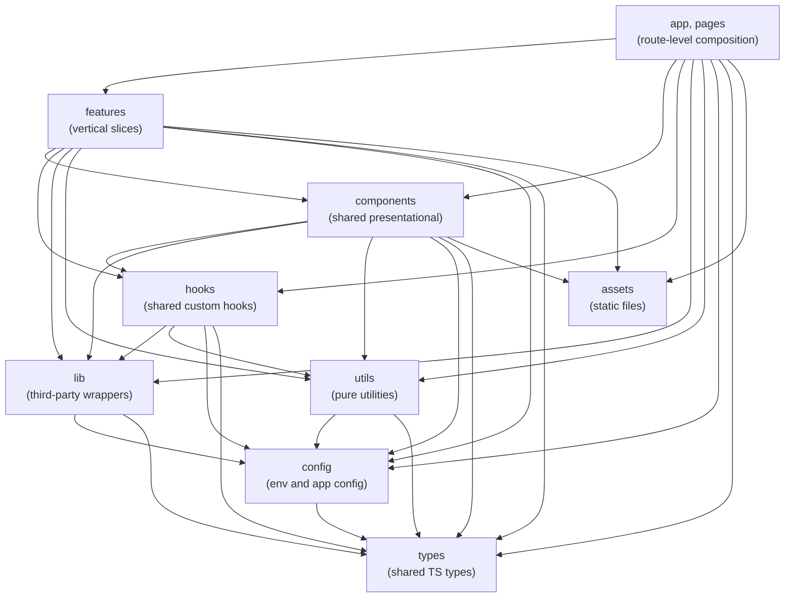
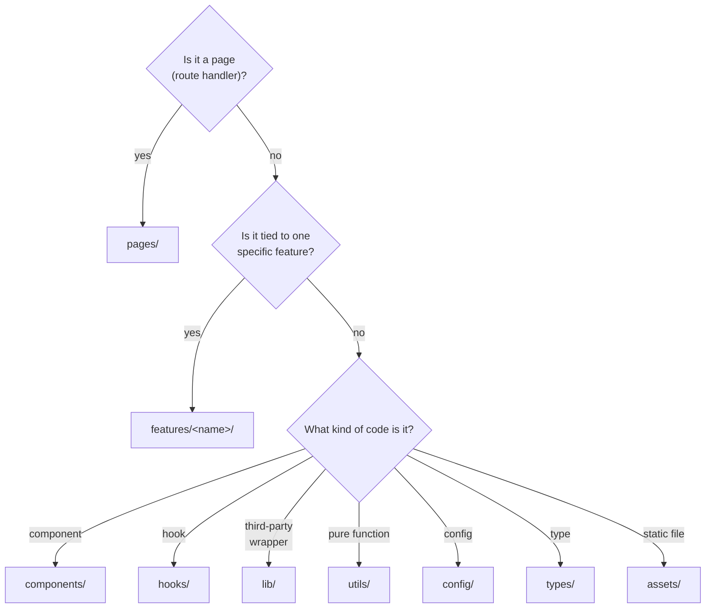

# Web features layout

`apps/web/` follows a [bulletproof-react](https://github.com/alan2207/bulletproof-react)
features layout. Architectural boundaries between layers are enforced by
ESLint via [`eslint-plugin-boundaries`](https://github.com/javierbrea/eslint-plugin-boundaries).

This document explains the layers, what may import from what, and how to
decide where new code goes. The authoritative source is
`apps/web/eslint.config.js`. If this doc and the config disagree, the
config wins.

## Why this exists

A growing single-page app has a predictable failure mode: cross-feature
imports build up, two features become coupled by accident, and refactoring
one breaks the other. The features layout treats each feature as a vertical
slice that owns its own components, hooks, and types. The shared layers
underneath (components, hooks, lib, utils, config, types, assets) are the
only thing features may share.

ESLint enforces this so it is not a code-review judgement call. Boundary
violations fail `pnpm lint` and CI.

## The layer hierarchy



Each layer corresponds to a directory under `apps/web/src/`:

| Layer        | Path                           | Role                                                |
| ------------ | ------------------------------ | --------------------------------------------------- |
| `app`        | `src/app/**`                   | Bootstrap: provider stack, router, route table      |
| `pages`      | `src/pages/**`                 | Route-level page composition                        |
| `features`   | `src/features/<name>/**`       | A vertical slice (e.g. `monsters/`, `design-system/`) |
| `components` | `src/components/**`            | Shared presentational components                    |
| `hooks`      | `src/hooks/**`                 | Shared custom hooks                                 |
| `lib`        | `src/lib/**`                   | Wrappers around third-party libs (api-client, query) |
| `utils`      | `src/utils/**`                 | Pure utility functions                              |
| `config`     | `src/config/**`                | Env validation and app configuration                |
| `types`      | `src/types/**`                 | Shared TypeScript types                             |
| `assets`     | `src/assets/**`                | Static files (images, fonts, etc.)                  |
| `testing`    | `src/testing/**`               | Test utilities; unrestricted (never imported by app code) |

## What may import from what

The rules, paraphrased from the ESLint config:

- `app` and `pages` may import from any layer below them. They orchestrate.
- `features` may import from any shared layer (`components` and below) and
  from itself. **A feature may not import from a sibling feature.**
- `components` may import from `hooks`, `lib`, `utils`, `config`, `types`,
  `assets`.
- `hooks` may import from `lib`, `utils`, `config`, `types`.
- `lib` and `utils` may import from `config` and `types`.
- `config` may import from `types`.
- `types` and `assets` import nothing from inside `src/`.
- `testing` is unrestricted but is never imported by app code. Test files
  themselves (`**/*.test.{ts,tsx}`) get a blanket exemption from boundary
  rules.

## The cross-feature block

This is the rule the config bends over backwards to enforce, because it
is the one that matters most:

```js
{
  type: 'features',
  pattern: 'src/features/*/**',
  capture: ['featureName'],
}
```

The `capture` mechanism lets the rule reference
`{{from.captured.featureName}}` when allowing imports between feature
files. So a file under `src/features/monsters/` may import from other
files under `src/features/monsters/`, but not from
`src/features/spells/`.

If two features genuinely need to share something, the right move is to
lift it. Three good destinations, in order of preference:

1. **`components`** if it is a presentational React component.
2. **`hooks`** if it is a custom hook.
3. **`lib`** if it is a wrapper around a third-party library.

Reaching across features (or worse, copy-pasting) is the failure mode
this layout exists to prevent.

## Where to put new code

A rough decision tree for new files:



When in doubt, start it inside a feature. Lifting it later is easy and
guided by the boundary rule. Lifting prematurely creates premature
abstractions.

## File and folder naming

Two `eslint-plugin-check-file` rules apply:

- **Files**: `**/*.{ts,tsx}` must be `kebab-case` (with middle extensions
  ignored, so `button.test.tsx` and `button.module.css` are fine).
- **Folders**: under `src/**`, must be `kebab-case`, with one exception
  for `__tests__/` (the colocated test directory pattern).

So:

- `monster-list-page.tsx`, yes
- `MonsterListPage.tsx`, no
- `src/features/monsters/`, yes
- `src/features/Monsters/`, no
- `src/features/monsters/__tests__/monster-list-page.test.tsx`, yes

## Other code-style rules worth knowing

- **`@typescript-eslint/consistent-type-imports`**: imports of types must
  use `import type` (or inline `type` keyword). Aligns with
  `verbatimModuleSyntax` in the tsconfig.
- **`react-compiler/react-compiler`**: enforced as `error`. Code must be
  compatible with the React Compiler's rules (no mid-render mutations of
  props, state, or external values).
- **`simple-import-sort/imports`**: imports are sorted into four groups
  (external, `@/` alias, parent-relative, sibling-relative).
- **No top-level arrow functions**: at module scope, use
  `function foo() {}` instead of `const foo = () => {}`. Arrow functions
  inside expressions are fine.
- **`react-hooks/recommended`** and **`jsx-a11y/strict`** are both on.

The full list lives in `apps/web/eslint.config.js`. Run `pnpm lint` (or
`task lint:web`) to check.

## Tests

Files matching `**/*.test.{ts,tsx}` get a blanket exemption from
`boundaries/no-unknown` and `boundaries/dependencies`. This is intentional:
test files often need to reach into private layers of whatever they are
testing.

Test files live next to the code they test, inside a `__tests__/`
directory:

```
src/features/monsters/
  monster-list-page.tsx
  __tests__/
    monster-list-page.test.tsx
```

## Where to look next

- `apps/web/eslint.config.js`, the source of truth
- [Architecture overview](README.md)
- [Local development](../recipes/local-development.md), how to run lint
- [bulletproof-react](https://github.com/alan2207/bulletproof-react), the
  reference project this layout is named after
