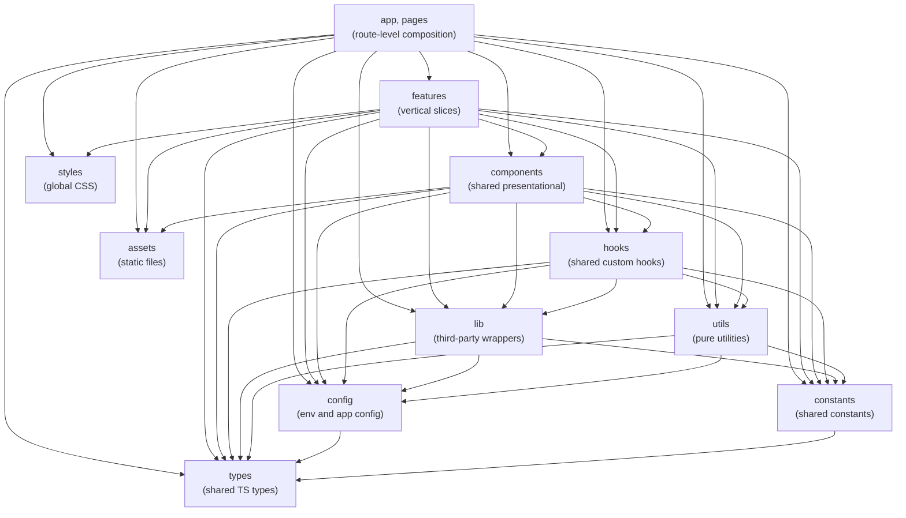
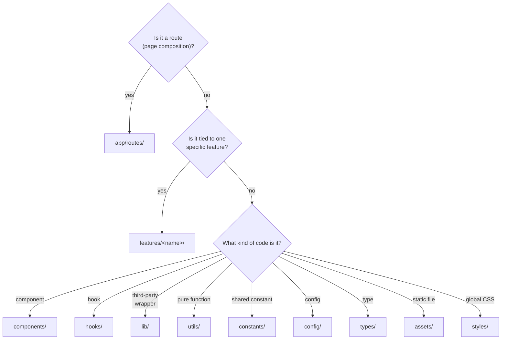

# Web features layout

`apps/web/` follows a
[bulletproof-react](https://github.com/alan2207/bulletproof-react) features
layout. Architectural boundaries between layers are enforced by ESLint via
[`eslint-plugin-boundaries`](https://github.com/javierbrea/eslint-plugin-boundaries).

This document explains the layers, what may import from what, and how to decide
where new code goes. The authoritative source is `apps/web/eslint.config.js`. If
this doc and the config disagree, the config wins.

## Why this exists

A growing single-page app has a predictable failure mode: cross-feature imports
build up, two features become coupled by accident, and refactoring one breaks
the other. The features layout treats each feature as a vertical slice that owns
its own components, hooks, and types. The shared layers underneath (components,
hooks, lib, utils, config, types, assets) are the only thing features may share.

ESLint enforces this so it is not a code-review judgement call. Boundary
violations fail `pnpm lint` and CI.

## The layer hierarchy



`constants` and `types` are leaves: `constants` imports only `types`, and
`types` imports nothing from `src/`. `styles` is global CSS, imported by `app`
(and by features for their own styling); it imports nothing from `src/`, so it
has no outgoing edges.

Each layer maps to a path under `apps/web/src/`:

| Layer        | Path                     | Role                                                                             |
| ------------ | ------------------------ | -------------------------------------------------------------------------------- |
| `app`        | `src/app/**`             | Bootstrap: provider stack, router, and route composition under `src/app/routes/` |
| `pages`      | `src/pages/**`           | Declared for route-level pages; no directory yet (see note)                      |
| `features`   | `src/features/<name>/**` | A vertical slice (e.g. `monsters/`, `spells/`, `design-system/`)                 |
| `components` | `src/components/**`      | Shared presentational components                                                 |
| `hooks`      | `src/hooks/**`           | Shared custom hooks                                                              |
| `lib`        | `src/lib/**`             | Wrappers around third-party libs (api-client, query)                             |
| `utils`      | `src/utils/**`           | Pure utility functions                                                           |
| `config`     | `src/config/**`          | Env validation and app configuration                                             |
| `types`      | `src/types/**`           | Declared for shared TS types; no directory yet (see note)                        |
| `assets`     | `src/assets/**`          | Static files (images, fonts, etc.)                                               |
| `styles`     | `src/styles/**`          | Global CSS: Radix overrides and typography                                       |
| `constants`  | `src/constants/**`       | Shared cross-feature constants                                                   |
| `testing`    | `src/testing/**`         | Test utilities; unrestricted (never imported by app code)                        |

`pages` and `types` are declared in the ESLint config so the boundary rules
already cover them, but neither has a directory yet: route composition currently
lives under `src/app/routes/`, and shared types have not needed lifting out of
features. Each gets its directory when it is first needed.

## What may import from what

The rules, paraphrased from the ESLint config:

- `app` and `pages` may import from any layer below them. They orchestrate.
- `features` may import from any shared layer (`components`, `hooks`, `lib`,
  `utils`, `config`, `constants`, `types`, `assets`, `styles`) and from itself.
  **A feature may not import from a sibling feature.**
- `components` may import from `hooks`, `lib`, `utils`, `config`, `constants`,
  `types`, `assets`.
- `hooks` may import from `lib`, `utils`, `config`, `constants`, `types`.
- `lib` and `utils` may import from `config`, `constants`, and `types`.
- `config` and `constants` may each import from `types`, and nothing else; both
  are leaves.
- `types` and `assets` import nothing from inside `src/`.
- `styles` is global CSS: it imports nothing from `src/` and is referenced by
  `app` (and by features for their own styling).
- `testing` is unrestricted but is never imported by app code. Test files
  themselves (`**/*.test.{ts,tsx}`) get a blanket exemption from boundary rules.

## The cross-feature block

This is the rule the config bends over backwards to enforce, because it is the
one that matters most:

```js
{
  type: 'features',
  pattern: 'src/features/*/**',
  capture: ['featureName'],
}
```

The `capture` mechanism lets the rule reference `{{from.captured.featureName}}`
when allowing imports between feature files. So a file under
`src/features/monsters/` may import from other files under
`src/features/monsters/`, but not from `src/features/spells/`.

If two features genuinely need to share something, the right move is to lift it.
Three good destinations, in order of preference:

1. **`components`** if it is a presentational React component.
2. **`hooks`** if it is a custom hook.
3. **`lib`** if it is a wrapper around a third-party library.

Reaching across features (or worse, copy-pasting) is the failure mode this
layout exists to prevent.

## UI primitives: import through re-exports

Feature and route code consume Radix Themes components and sonner toasts through
the project's own wrappers, never the upstream packages directly. This keeps
theming, token overrides, and toast configuration in one place and lets an
implementation change without touching every call site.

ESLint enforces it with `no-restricted-imports` (issue #208):

- `@radix-ui/*` may be imported only by the re-export barrels and Radix wrappers
  under `src/components/**`, plus the two app-root files that set up the theme:
  `src/app/provider.tsx` (the `<Theme>` shell) and `src/main.tsx` (the
  `styles.css` side-effect). Everywhere else, import the primitive from a
  `@/components/ui/*` barrel; add a barrel if one does not exist yet.
- `sonner` may be imported only by `src/lib/notifications/notify.ts` (the notify
  seam) and `src/components/ui/toaster/app-toaster.tsx`, which owns sonner's
  presentation config. Everywhere else, raise toasts through the `notify` seam.

The app root is carved out rather than routed through a re-exported
`Theme`/`ThemePanel` because the `@radix-ui/themes/styles.css` side-effect
import has no barrel equivalent. The carve-out is scoped to those two files, not
all of `src/app/**`: route modules under `src/app/routes/` have no reason to
import Radix directly either.

## Prefetching on hover intent

Navigable links and cards warm their destination's React Query cache on hover
and keyboard focus, so the click renders without a loading flash. This is the
default for any link or card that leads to a fetched page. The pieces are split
to respect the boundary rules:

- **Feature `api/` modules** export a `prefetch<Thing>` helper next to each
  query-options factory. `prefetchMonster(queryClient, slug)` wraps
  `queryClient.prefetchQuery(getMonsterQueryOptions(slug))`, and
  `prefetchMonsters(queryClient, filters?)` the list. They are fire-and-forget
  and respect `staleTime`, so warming an already-fresh entry is a no-op.
- **`hooks/use-hover-prefetch`** is the generic primitive. Given a `prefetch`
  closure it returns pointer/focus handlers to spread onto a link; it fires once
  per hover after a short debounce (cancelled if the cursor leaves first) and
  no-ops when handed `undefined`.
- **`lib/prefetch`** holds a path-keyed registry (`usePathPrefetch`) so a
  component can warm a route by its path without importing feature code.
- **`app/prefetch.ts`** builds the concrete nav registry, mapping each nav path
  to its list prefetch. It lives in the app layer because it reaches into
  feature `api/` modules, which `components/**` may not.

A **card** (feature layer) wires its own feature's helper directly:

```tsx
const queryClient = useQueryClient();
const hover = useHoverPrefetch(() => {
  prefetchSpell(queryClient, spell.slug);
});
// <Card asChild><Link {...hover} to={...}>...</Link></Card>
```

A **nav link** (component layer, which may not import features) reads the
registry instead, keeping the feature coupling in the app layer:

```tsx
const hover = useHoverPrefetch(usePathPrefetch(to));
```

To make a new nav path prefetch, add a `path -> prefetch` entry to
`app/prefetch.ts`; the link picks it up automatically.

## Where to put new code

A rough decision tree for new files:



When in doubt, start it inside a feature. Lifting it later is easy and guided by
the boundary rule. Lifting prematurely creates premature abstractions. The same
goes for constants: keep a constant in the feature that uses it, and lift it to
`constants/` only once a second feature needs it.

## File and folder naming

Two `eslint-plugin-check-file` rules apply:

- **Files**: `**/*.{ts,tsx}` must be `kebab-case` (with middle extensions
  ignored, so `button.test.tsx` and `button.module.css` are fine).
- **Folders**: under `src/**`, must be `kebab-case`, with one exception for
  `__tests__/` (the colocated test directory pattern).

So:

- `monster-list-page.tsx`, yes
- `MonsterListPage.tsx`, no
- `src/features/monsters/`, yes
- `src/features/Monsters/`, no
- `src/features/monsters/__tests__/monster-list-page.test.tsx`, yes

## Other code-style rules worth knowing

- **`@typescript-eslint/consistent-type-imports`**: imports of types must use
  `import type` (or inline `type` keyword). Aligns with `verbatimModuleSyntax`
  in the tsconfig.
- **`react-compiler/react-compiler`**: enforced as `error`. Code must be
  compatible with the React Compiler's rules (no mid-render mutations of props,
  state, or external values).
- **`simple-import-sort/imports`**: imports are sorted into four groups
  (external, `@/` alias, parent-relative, sibling-relative).
- **No top-level arrow functions**: at module scope, use `function foo() {}`
  instead of `const foo = () => {}`. Arrow functions inside expressions are
  fine.
- **`react-hooks/recommended`** and **`jsx-a11y/strict`** are both on.
- **`no-restricted-imports` (Radix + sonner)**: feature and route code import
  Radix and sonner through re-exports, not the upstream packages. See
  [UI primitives: import through re-exports](#ui-primitives-import-through-re-exports).

The full list lives in `apps/web/eslint.config.js`. Run `pnpm lint` (or
`task lint:web`) to check.

## Tests

Files matching `**/*.test.{ts,tsx}` get a blanket exemption from
`boundaries/no-unknown`, `boundaries/dependencies`, and the Radix/sonner import
guard. This is intentional: test files often need to reach into private layers
of whatever they are testing, and test render helpers wrap components in
`<Theme>` imported directly from `@radix-ui/themes`.

Test files live next to the code they test, inside a `__tests__/` directory:

```
src/features/monsters/
  monster-list-page.tsx
  __tests__/
    monster-list-page.test.tsx
```

## Where to look next

- `apps/web/eslint.config.js`, the source of truth
- [Architecture overview](README.md)
- [Local development](../recipes/local-development.md), how to run lint
- [bulletproof-react](https://github.com/alan2207/bulletproof-react), the
  reference project this layout is named after
